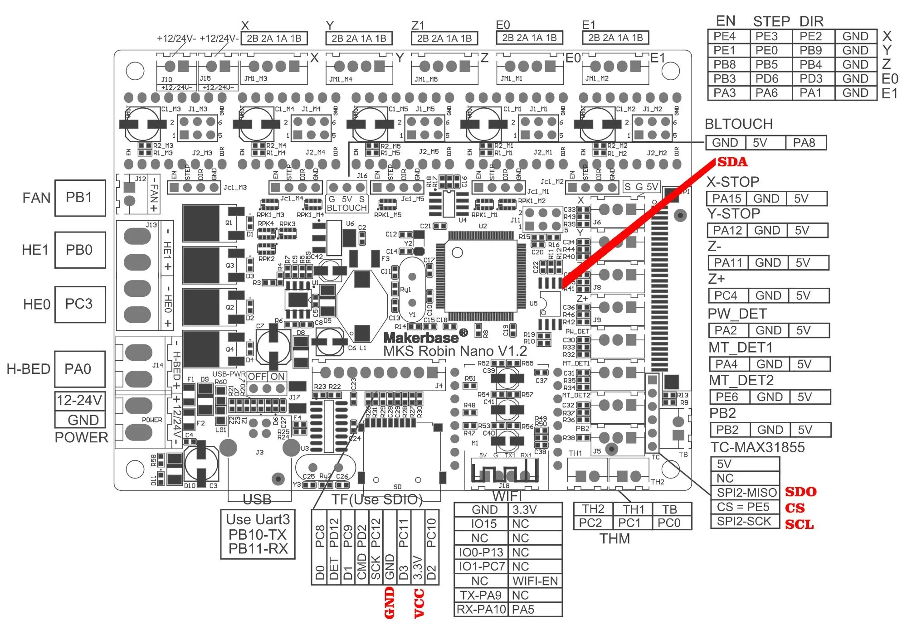

# MKS Robin nano v1.1 and v1.2

# Pinout Diagram

# Genric Information (from https://sergey1560.github.io/fb4s_howto/mks_board/)

* МК: STM32F103VET6 72Mhz, 512KB flash, 64KB Ram
* Драйвера: сменные. На 4S устанавливались 4 драйвера A4988, на 5 в разное время устанавливался разный набор драйверов: либо 2 драйвера A4988 + 2 драйвера TMC 2208, либо все 4 драйвера TMC 2208.
* Экран: параллельная 16-бит шина, FSMC
* Bootloader:
  * Загрузчик от платы v1.1 записан с начала flash, по адресу 0x08000000
  * Загрузчик от платы v1.2 записан с начала flash, по адресу 0x08000000
  * Смещение основной прошивки - 0x7000 (28кб). Загрузчик использует шифрование основной прошивки.
  * В качестве алгоритма шифрования используется xor ключем {0xA3, 0xBD, 0xAD, 0x0D, 0x41, 0x11, 0xBB, 0x8D, 0xDC, 0x80, 0x2D, 0xD0, 0xD2, 0xC4, 0x9B, 0x1E, 0x26, 0xEB, 0xE3, 0x33, 0x4A, 0x15, 0xE4, 0x0A, 0xB3, 0xB1, 0x3C, 0x93, 0xBB, 0xAF, 0xF7, 0x3E} с 320 по 31040 байт основной прошики. Это шифрование уже добавлено в Marlin (автоматически при сборке) и Klipper (скрипт /scripts/update_mks_robin.py)
* Схема: Схема
* Стандартная прошивка:
  * 2 драйвера А4988 и 2 драйвер 2208
  * 4 драйвера 2208
* Дополнительно: Различие плат MKS Robin Nano V1.1 и Flying Bear Reborn v2.0 отсутствует, это одна и таже плата.

The main differences in V1.2 are the presence of a BLTouch connector and the ability to disconnect the board's power from USB. \
In Marlin, the MOTHERBOARD parameter must be set to BOARD_MKS_ROBIN_NANO. In platformio.ini, set default_envs = mks_robin_nano35, and the screen type to MKS_ROBIN_TFT35.
