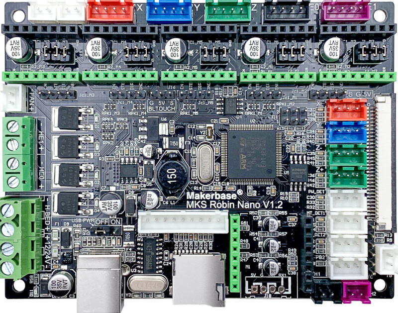
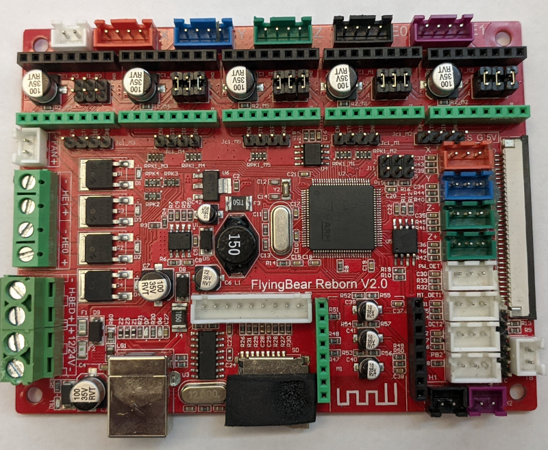

# MKS Robin nano v1.1 and v1.2

# Pinout Diagram

# Genric Information (from https://sergey1560.github.io/fb4s_howto/mks_board/)

* МК: STM32F103VET6 72Mhz, 512KB flash, 64KB Ram
* Drivers: Replaceable. The 4S was equipped with 4 A4988 drivers. The 5 featured different driver configurations at various times: either 2 A4988 drivers + 2 TMC 2208 drivers, or all 4 TMC 2208 drivers.
* Display: 16-bit parallel bus, FSMC
* Bootloader:
  * [The v1.1 board bootloader](https://sergey1560.github.io/fb4s_howto/mks_board/robin_nano_v1/rn_v11_bootloader.bin) is flashed at the beginning of the flash memory, at address 0x08000000.
  * [The v1.2 board bootloader](https://sergey1560.github.io/fb4s_howto/mks_board/robin_nano_v1/rn_v12_bootloader.bin) is flashed at the beginning of the flash memory, at address 0x08000000.
  * The main firmware offset is 0x7000 (28 KB). The bootloader uses encryption for the main firmware.
  * The encryption algorithm uses a XOR cipher with the key {0xA3, 0xBD, 0xAD, 0x0D, 0x41, 0x11, 0xBB, 0x8D, 0xDC, 0x80, 0x2D, 0xD0, 0xD2, 0xC4, 0x9B, 0x1E, 0x26, 0xEB, 0xE3, 0x33, 0x4A, 0x15, 0xE4, 0x0A, 0xB3, 0xB1, 0x3C, 0x93, 0xBB, 0xAF, 0xF7, 0x3E} from bytes 320 to 31040 of the main firmware. This encryption is already integrated into Marlin (automatically during compilation) and Klipper (via the /scripts/update_mks_robin.py script).
* Scheme: [Scheme](MKS_Robin_Nano_V1.1_SCH.pdf)
* Stock Firmware:
  * [2x A4988 drivers and 2x TMC2208 drivers](https://sergey1560.github.io/fb4s_howto/mks_board/robin_nano_v1/firmware_v1_(4988+2208).zip)
  * [4x TMC2208 drivers](https://sergey1560.github.io/fb4s_howto/mks_board/robin_nano_v1/firmware_v1_(4x2208).zip)
* Notes: There is no difference between the MKS Robin Nano V1.1 and Flying Bear Reborn v2.0 boards; they are the exact same board.

The main differences in V1.2 are the presence of a BLTouch connector and the ability to disconnect the board's power from USB. \
In Marlin, the MOTHERBOARD parameter must be set to BOARD_MKS_ROBIN_NANO. In platformio.ini, set default_envs = mks_robin_nano35, and the screen type to MKS_ROBIN_TFT35.
